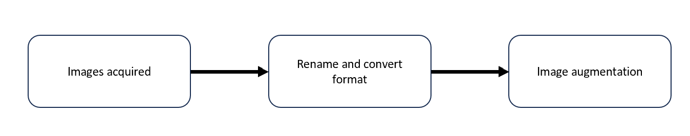
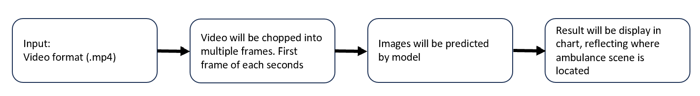

# Capstone Project - Scene search AI for video

Author - Ponparis Gurdsapsri 

---

## Project Description

* **Objective:** 
    + To build AI model to detect and locate where (which seconds) the specified scene is on the subject video (Clasify whether it is or it is not)
* **Data:**  
    + Image file for model training and testing are scraped and downloaded from internet. Original 251 pictures has been manually annotated. Those image then have been processed via augmented technique to increase for trained/tested the model up to 13,420 pictures  
    + Video file for model deployment testing are obtained from True ID channel used video download technique
* **Metric:**
    + Classification: Accuracy
+ **Target outcome:**
    + Locate "ambulance" appearance scene on the video
    + Provide screen capture picture of the particular scene

---

## Problem Statement
Revenue from content platform is directly related to number of view of the content. One of the technique that content marketing use is, thumbnail manipulation. They may use different thumbnail for the same content to target. For example, content marketing may select the picture of particular main character as thumbnail picture for targeting their fan base subscriber, or the picture of sport car to target to motor sport fan base, etc.

For someone who know or have seen the content, this is piece of cake to go through and select the particular minutes of the video, to be used as thumbnail. Now, imagine if there are tens of thousands of video. It would take eternity for a few people to go through all video to find the selected scene. 

So, as this capstone project. I’d develop AI tool to search the entire video to find the select scene and locate which minute the scene is on.The tool will help minimize work load and minimize dependency on content experty.

---
## Background and limitation

Scene selection is based on pre-trained Convolutional Neural Network model called VGG-16. The structure of the newtwork is set for a RGB image with resolution of 224 x 224 pixel, going through multiple layers with more than a millions of images were used for model training(ref-1). The VGG-16 is selected because it has decent performance benchmark, and most importantly, it has been around since 2014. So it has the most availability in term of research resources.

The video classification model would require very high computation power. With limited time and resource, I selected to transform video into image and process image classification instead of video.

**The following figure is VGG structure diagram (ref-2)**

---
## Modeling 

### Pre-processing
Even thought VGG-16 has been trained by millions of images, but the model may still over/under fit our case. In order to localized the model, I seeked for local ambulance images to be used for training.

The images accquired from internet were renamed to numeric order for easily used in coding and saved in .jpg format ensure that they're in acceptable format (.bmp, .gif, .jpg, .png) to train to VGG-16 model. Then they were augmented in various patterns (rotate, flip, blur, crop) to increase size of trained images.

### Model training and fine-tuning
Conducting 3 trains.
First train
The processed images will be prepared and splited into train/test (90/10) and process into list of filename, then it will be process into pipeline. Here all train data will be converted to 224x224 pixel to fit the pipeline input. The additional 3 layers are added to model to be used for model training. 3 layers are: Global average 2D, Dense(512, relu), and output layer Dense(2, softmax), to predict classification of ambulance. 251 images without any augmentation is used here for training this first model. 

Second train
The augemented images, including original images (total 13,420 images) are used to train model, with same 3 additional layers on top of VGG-16 as previous model. train/test split is also 90/10.

Third train
Use augmented images train 5 more layers. The first 2 layers, train data only been trained on additional 3 layers that I have added. This time, I selected another 5 out of original 16 layers, and train them with train data. Now there were 8 layers that have been train.

### Model evaluation
As mentioned in objective, the metric used for evaluation will be the accuracy score of train and validation data. With additional of known 4 image for model to predict.

Model#|Train accuracy score|Test accuracy score|4 images accuracy|
|---|---|---|---|
First|0.583|0.667|0.75|
Secon|0.738|0.583|0.50|
Third|0.742|0.750|0.75|

The third model provides best performance. So I selected the third model to be used for deployment test.

### Deployment test
As stated in the objective. The input will be in video format, then the model will locate where ambulance scene is at. To do so, there will be some transformation from video to image before running them into prediction model. The below are the process.

## Conclusion
The first test video has duration of 47 seconds. The model predict 34% correctly.
The Second test video has duration of 35 secods. The mode predict 94% correctly.

The first video is during the night time, and most of trained data are bright lighting. Where second video is during day time and the prediction looks very good. It is possible that the train data are lacking night image. 

To improve the model, it is likely that we need large images for training.

## Reference
*1 - Information of number of parameter were used for VGG-16: 
https://www.analyticsvidhya.com/blog/2020/08/top-4-pre-trained-models-for-image-classification-with-python-code/
*2 - Complete guide of VGG-16 on Kaggle:
https://www.kaggle.com/code/blurredmachine/vggnet-16-architecture-a-complete-guide

